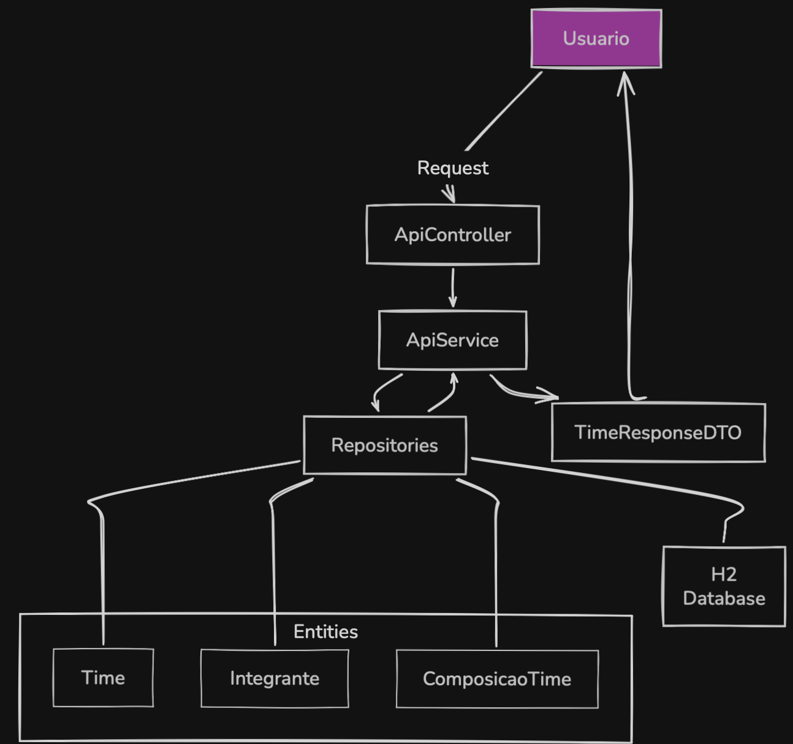

# Arquitetura da Solução e Decisões

Este documento detalha a fundamentação técnica e os princípios de design aplicados no desenvolvimento deste projeto, priorizando a criação de um código sustentável, legível e seguro.

## Decisões de Arquitetura e Clean Code

### Princípio DRY e Design Antecipado

A implementação do método `filtrarPorPeriodo` no `ApiService` foi fruto de um Design Antecipado.

- **Análise de Inserção:** Antes de codificar os métodos de estatística, houve uma análise da necessidade comum de filtragem temporal.
- **Referência Pragmática:** Conceito extraído do livro *The Pragmatic Programmer*. Ao centralizar esta lógica, garanti que qualquer mudança na regra de negócio de datas seja refletida em todo o sistema de forma atômica.

### Teoria da Janela Quebrada (Broken Windows Theory)

A arquitetura foi mantida com um padrão de excelência desde o início, evitando "janelas quebradas" (pequenos erros que incentivam o desleixo futuro).

- **Prática:** Refatoração constante para manter métodos curtos, responsabilidade única e uma estrutura de pastas organizada.

### Blindagem de Dados e Estratégia Fail-Fast

O sistema aplica o conceito de Falha Rápida. Se o dado de entrada for inválido, o sistema interrompe o processamento imediatamente.

- **RequestDTO & Bean Validation:** Uso de `@NotBlank`, `@NotNull` e `@NotEmpty` junto ao `@Valid`. Isso impede que o banco de dados receba dados inconsistentes e economiza processamento.
- **ResponseDTO:** Garante a visibilidade controlada dos dados, enviando apenas o necessário e protegendo a integridade das entidades do modelo.

## Engenharia de Relacionamentos e JSON

### Evolução do Modelo e Sobrecarga de Construtores

Para adicionar a funcionalidade de "Nome do Time" sem comprometer a integridade e as regras originais do desafio, apliquei o conceito de Sobrecarga de Construtores na entidade `Time`.

- **Flexibilidade e Compatibilidade:** O modelo agora conta com dois construtores principais. Um aceita o campo nome (suportando a nova funcionalidade do frontend), enquanto o outro mantém a estrutura original apenas com data.
 - Essa decisão de arquitetura permitiu que eu estendesse o sistema sem alterar as assinaturas dos métodos pré-existentes no `ApiService` e nos testes unitários originais.
- **Vínculo de Relacionamento:** A estrutura garante que, independente do construtor utilizado, a lista de `ComposicaoTime` seja inicializada corretamente, permitindo que o vínculo bidirecional com os integrantes ocorra de forma consistente em memória antes da persistência no PostgreSQL.

### Gestão de Relacionamentos e JSON

Além da flexibilidade nos construtores, foquei na blindagem do tráfego de dados entre API e Frontend:

- **Resolução de Recursividade Infinita:** Utilizei as anotações `@JsonManagedReference` no `Time` e `@JsonBackReference` na `ComposicaoTime`.
- **Controle de Ciclos:** Como o `Time` possui uma lista de composições e cada composição aponta de volta para o time, o Jackson (serializador JSON) entraria em loop infinito. Essas anotações cortam a recursão, garantindo que o JSON enviado ao Vue seja limpo e estruturado.

## Ferramentas e Performance

### Backend

- **Java 21:** Uso de `LocalDate` para manipulação moderna de datas e lógica iterativa pura para total domínio sobre o fluxo de dados.
- **PostgreSQL:** Banco de dados robusto utilizado para validar a persistência em cenários reais com múltiplos dados.
- **Global Exception Handler:** Uso de `@RestControllerAdvice` para capturar erros e entregar mensagens amigáveis (UX), impedindo a exposição de detalhes internos do servidor.
- **CORS (`@CrossOrigin`):** Configurado para permitir a integração segura com o Frontend em Vue.js.

